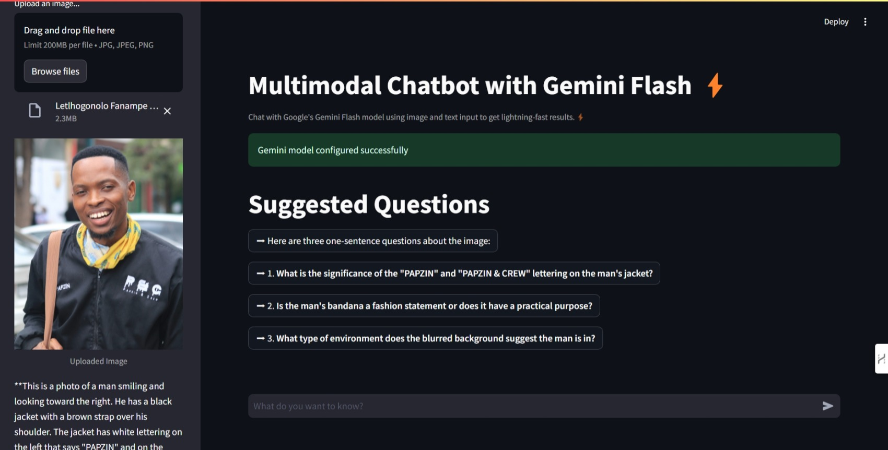

# Gemini Multimodal Interaction Bot

This project is a Streamlit web application that uses Google's Gemini Flash model to create a multimodal interaction bot. Users can input text and upload images, and the bot generates responses based on the provided inputs.

[Try it out here](https://gemini-multimodal-interaction-bot.streamlit.app/)




## Features

- Accepts text input from the user
- Allows users to upload images
- Generates responses using the Gemini Flash model
- Maintains chat history within the session

## Installation

1. Clone the repository:
    ```bash
    git clone https://github.com/djpapzin/Gemini-Multimodal-Interaction-Bot.git
    cd Gemini-Multimodal-Interaction-Bot
    ```

2. Create and activate a virtual environment (optional but recommended):
    ```bash
    python3 -m venv venv
    source venv/bin/activate   # On Windows, use `venv\Scripts\activate`
    ```

3. Install the required packages:
    ```bash
    pip install -r requirements.txt
    ```

4. Rename `.env.example` to `.env` and add your Google Gemini API key. The API key can be obtained from [Google AI Studio](https://aistudio.google.com/app/apikey):
    ```bash
    mv .env.example .env
    ```

5. Open `.env` and add your Google API key:
    ```
    GOOGLE_API_KEY=your_google_api_key_here
    ```

## Usage

1. Run the Streamlit application:
    ```bash
    streamlit run app.py
    ```

2. Open your web browser and go to the URL provided by Streamlit (usually `http://localhost:8501`).

3. Enter your Google API key, input text, and/or upload images to interact with the chatbot.

## License

This project is licensed under the MIT License - see the LICENSE file for details.

## Acknowledgements

- Google for providing the Gemini Flash model.
- Streamlit for the web application framework.